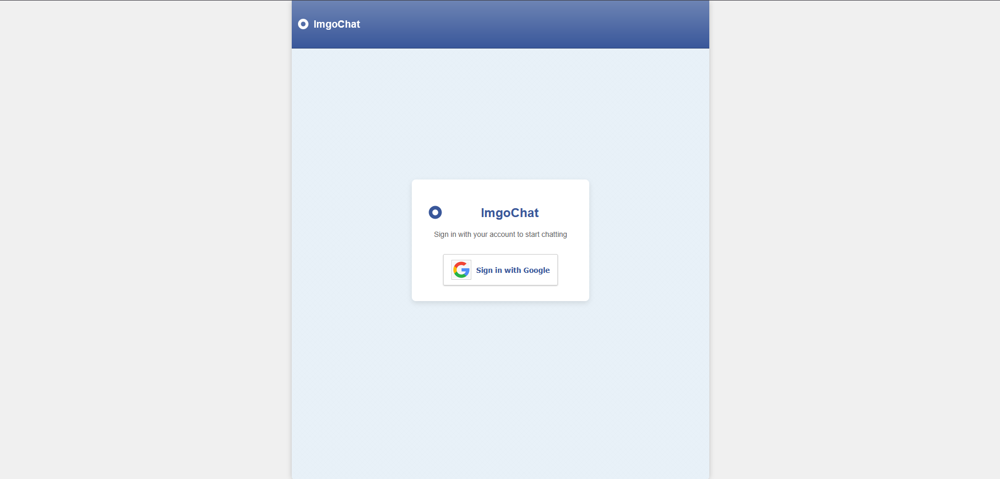
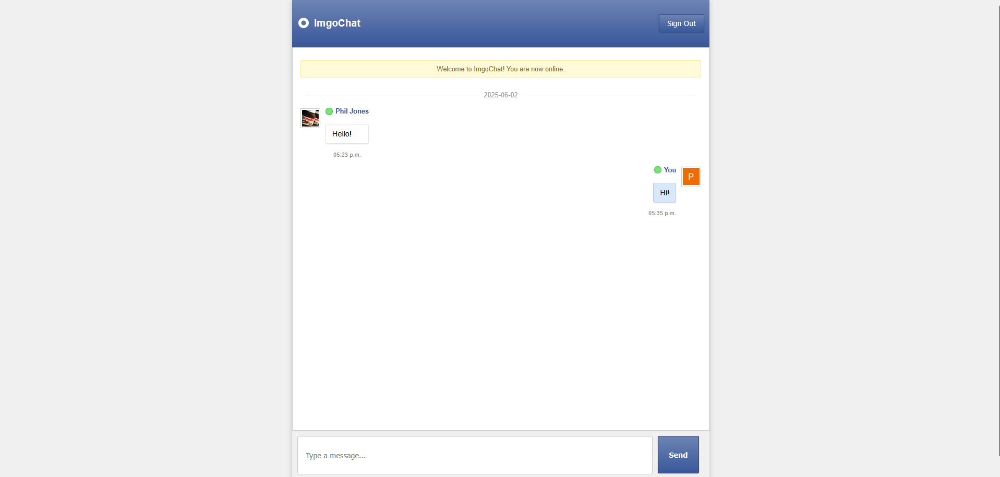

# ImgoChat 💬


## Overview

ImgoChat is a chat application inspired by the nostalgic MSN Messenger experience but enhanced with contemporary features. It combines the charm of early 2000s instant messaging with the security and functionality expected in today's applications.

## Inspiration

This project was inspired by the Fireship YouTube channel video that showcased classic web applications reimagined with modern technologies. The goal was to capture the essence of MSN Messenger while implementing current best practices in web development.

## Features

- **MSN Messenger-inspired UI** with a modern twist
- **Google Authentication** for secure user login
- **User Profile Integration** displaying Google profile name and photo
- **Fallback Profile Pictures** for users without Google profile images
- **Bad Word Filtering** that automatically replaces offensive language with asterisks
- **Message Timestamps** and date separators for better conversation tracking
- **Responsive Design** for seamless use across devices

## Technologies Used

- React.js
- Firebase (Authentication, Firestore, Hosting)
- CSS3 for styling

## Getting Started

### Prerequisites

- Node.js (v14 or later)
- npm or yarn
- Firebase account

### Installation

1. Clone the repository
   ```bash
   git clone https://github.com/yourusername/imgochat.git
   cd imgochat
   ```

2. Install dependencies
   ```bash
   npm install
   # or
   yarn install
   ```

3. Set up Firebase configuration
   - Create a `.env` file in the root directory
   - Add your Firebase configuration variables:
     ```
     REACT_APP_FIREBASE_API_KEY=your_api_key
     REACT_APP_FIREBASE_AUTH_DOMAIN=your_auth_domain
     REACT_APP_FIREBASE_PROJECT_ID=your_project_id
     REACT_APP_FIREBASE_STORAGE_BUCKET=your_storage_bucket
     REACT_APP_FIREBASE_MESSAGING_SENDER_ID=your_messaging_sender_id
     REACT_APP_FIREBASE_APP_ID=your_app_id
     ```

4. Start the development server
   ```bash
   npm start
   # or
   yarn start
   ```

5. Open [http://localhost:3000](http://localhost:3000) in your browser

## Deployment

ImgoChat can be easily deployed to Firebase Hosting:

```bash
npm run build
firebase deploy
```

## Contributing

Contributions are welcome! Please feel free to submit a Pull Request.

1. Fork the repository
2. Create your feature branch (`git checkout -b feature/amazing-feature`)
3. Commit your changes (`git commit -m 'Add some amazing feature'`)
4. Push to the branch (`git push origin feature/amazing-feature`)
5. Open a Pull Request

## License

This project is licensed under the MIT License - see the LICENSE file for details.

## Acknowledgments

- Fireship YouTube channel for the inspiration
- Microsoft for the original MSN Messenger that inspired this project
- The React and Firebase teams for their amazing tools

## Screenshots




---

Built by Philtwo
